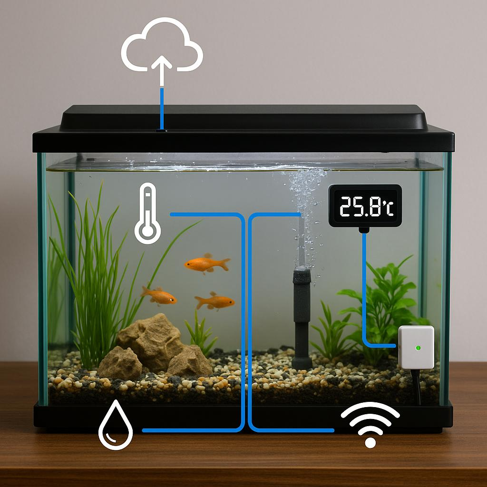

# automated-aquarium

## Overview

The Automated Aquarium project aims to transform a traditional aquarium into a smart IoT device. By integrating various sensors and a camera, you can monitor and control different aspects of your aquarium remotely. The project includes streaming live footage of the aquarium on Twitch, viewing real-time data collected from the sensors, and managing the aquarium's environment. This project leverages a variety of technologies, ranging from web development to embedded software.

>As this is an ongoing project, features and implementations may evolve over time.

A comprehensive guide with documentation links will be provided to help you set up and maintain your automated aquarium.

## Automated Aquarium Website

This project is complemented by a website built using Next.js. The website serves as the user interface for monitoring and controlling your automated aquarium.

  

For more details and to get started with the web interface, visit the [automated-aquarium-web](https://github.com/Joserra13/automated-aquarium-web) repository.

  

