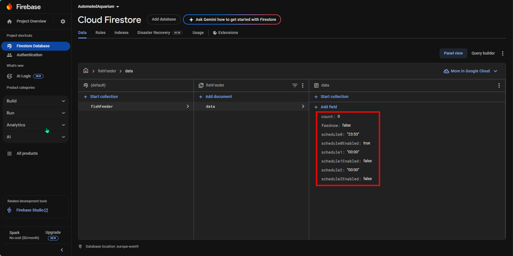

# How to set up the Firebase project

## Index

- [Get credentials](#get-credentials)
- [Create database](#create-database)
- [How to access the database](#how-to-access-the-database)

## Get credentials

Navigate to the [Firebase Console](https://console.firebase.google.com/u/3/) and create a new project. You just need to follow the default configuration.


Navigate to the Authentication tab and enable Email/Password and Google sign in methods:


Now, if you navigate to **Project Settings**, at this point, we are ready to fill the 4 variables in the [credentials.py](../src/RaspberryPi-Pico-W/Feeder/credentials.py.example) file:

```
FIREBASE_EMAIL => Is the email used to create the Firebase project.
FIREBASE_PW => Is the password of the email used to create the Firebase project.
FIREBASE_API_KEY => Is the Web API key displayed in the screenshot.
FIREBASE_PROJECT_ID => Is the Project ID displayed in the screenshot.
```


## Create database

Navigate to **Product categories** -> Build -> Firestore Database and select **Create database**. You can keep the default values.


Now, create a collection to store values in your database. I will start with this values:



In order to query the values from the outside, we need to modify the rules as follows:


## How to access the database

Since we are querying the database from the Raspberry Pi Pico, we need a token to authenticate the device. To get this token, we need to first sign up to google like the following query:

### Sign up with email / password

You can check the documentation in the following [link](https://firebase.google.com/docs/reference/rest/auth?authuser=2#section-create-email-password). You only need to do this once.


### Sign in with email / password

In order to get the token whenever it expires, you need to sign in again. Check the documentation in the following [link](https://firebase.google.com/docs/reference/rest/auth?authuser=2#section-sign-in-email-password). I don't attach another screenshot because the body and the response is the same.

### Read the values from the database

In order to read the values from the database you need to make a GET request to the database. Hint: You need to add the **idToken** obtained in the previous query as **Bearer Token** in your Authorization header. See [documentation](https://firebase.google.com/docs/firestore/reference/rest/v1/projects.databases.documents/get?authuser=2) to get more information.


See body:

```json
{
    "documents": [
        {
            "name": "projects/my-aquarium-test/databases/(default)/documents/fishFeeder/data",
            "fields": {
                "feednow": {
                    "booleanValue": false
                },
                "count": {
                    "integerValue": "13"
                }
            },
            "createTime": "2025-06-12T15:51:06.841043Z",
            "updateTime": "2025-06-12T15:54:03.688480Z"
        }
    ]
}
```

### Write values to the database

To write values to the database, you need to make a POST request to the Firestore endpoint. Make sure to include the **idToken** in the Authorization header as a Bearer Token. Refer to the [official documentation](https://firebase.google.com/docs/firestore/reference/rest/v1/projects.databases.documents/commit?authuser=2) for details on the request format and required fields.


See body:

```json
{
  "writes": [
    {
      "update": {
        "name": "projects/my-aquarium-test/databases/(default)/documents/fishFeeder/data",
        "fields": {
          "feednow": { "booleanValue": false },
          "count": { "integerValue": 7 }
        }
      },
      "updateMask": {
        "fieldPaths": ["feednow", "count"]
      }
    }
  ]
}
```