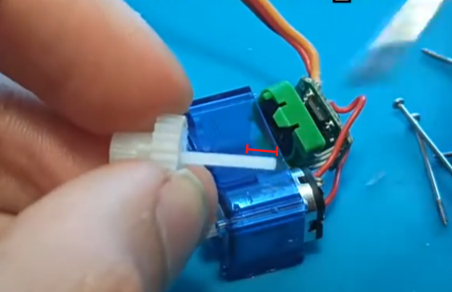

# Convert SG90 servo into a continuous movement one

## Overview

Some SG90 servos can only rotate 180 degrees. Since this was the case of the one I own, I needed to perform some modifications into the hardware to convert it into a continuous movement servo.

## How can I hack it?

1. Disassemble servo.

2. Remove the ending part of the gear shown below:

    

3. Load the following script into your device (e.g. an Raspberry Pi pico) to calibrate the potentiometer.
The potentiometer should me modified so when **my_servo.write(90)** is executed, the servo is fully stopped.

    >**Note**: This script works for python/micropython boards. For Arduinos, you should use another script but following the same commands for the movements.

    ```py
    import time
    from servo import Servo

    # Create our Servo object, assigning the
    # GPIO pin connected the PWM wire of the servo
    my_servo = Servo(pin_id=28)

    while True:
        my_servo.write(90)  # Set the Servo to stop
        time.sleep_ms(1000)  # Wait for 1 second
        
        my_servo.write(0)  # Move the servo clockwise
        time.sleep_ms(1000)  
        
        my_servo.write(180)  # Move the servo counterclockwise
        time.sleep_ms(1000)  
    ```

4. Glue the potentiometer to secure a fixed position and prevent modifications due to vibrations:
    
    

5. Test movement again to check if the servo works as intended.

6. Assemble potentiometer again.

## How does it work?

Continuous rotation servos work similarly to regular angular servos. If your library uses input angles of 0–180°, you can set the speed and direction of a continuous servo like this:
  - 180 - 100% speed counterclockwise
  - 135 - 50% speed counterclockwise
  - 90 - Stopped
  - 45 - 50% speed clockwise
  - 0 - 100% speed clockwise


## References:

- [Hack the SG90 servo to make it continuous rotation](https://www.youtube.com/watch?v=4Z-j6bUJTQ8) from H.R.E Systems in Youtube.

- [Calibration script](https://core-electronics.com.au/guides/getting-started-with-servos-examples-with-raspberry-pi-pico/#:~:text=Servo%20in%20action.-,Remix%202%20%2D%20Rotational%20Servo%20Control,-Finally%2C%20let%27s%20have) for the potentiometer.

- [Continuous rotation servo graphic](https://forums.raspberrypi.com/viewtopic.php?t=341927) from the Raspberry Pi Forum.