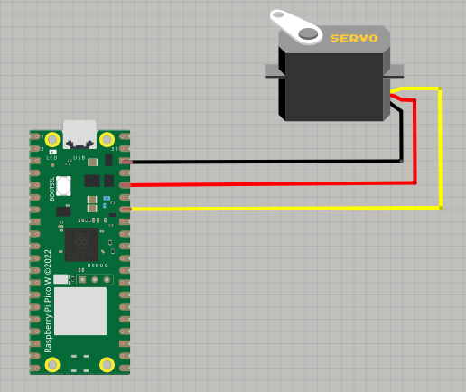
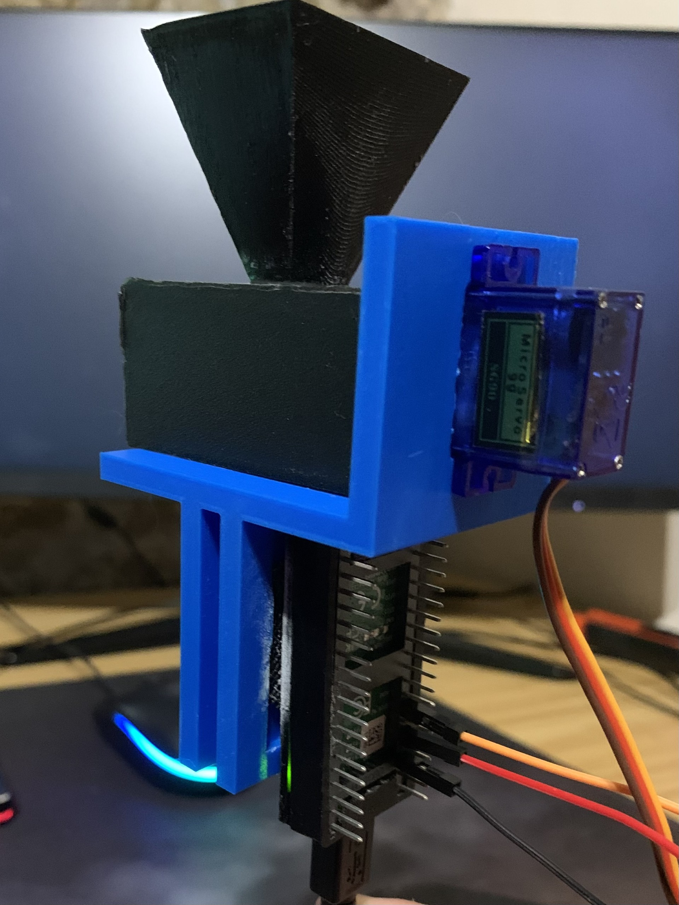
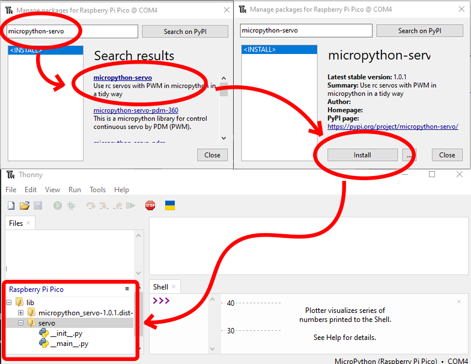

# Fish Feeder

## Overview

The automatic fish feeder allows to schedule diferent timeslots to feed your fishes automatically. You only need to worry about placing the food in the storage so, the feeder will provide the food periodically to your fishes.

## Materials needed

### Hardware

- Raspberry Pi Pico W (+ charging cable).
- 3d parts printed.
- SG90 Servo (Continuous Rotation).

    >Most of the SG90 servos can only rotate 180 degrees. If this is your case, you can follow the [explained steps](../../docs/hack-servo.md) to hack your servo and convert it into a 360 rotation.

- 3x Male to Female wires.

### Software

- Thonny IDE. See [documentation](https://thonny.org/).

## Circuit

Depending on the device you are using, this schematic might change. In my case, I am using a Raspberry Pi pico W, you can check out the pinout in the following [Raspberry Pi pico documentation](https://www.raspberrypi.com/documentation/microcontrollers/pico-series.html#:~:text=Raspberry%20Pi%20Pico%20W%20and%20Pico%20WH).

## 3D pieces and assembling

Since some pieces are needed to build the feeder, you can print the different parts from the files under the [3D models](./3D%20models) folder. For the main body, I had to remove the original piece where the Wemos board is stored. In addition, I printed a Raspberry Pi pico W case which I glued to the main body.

> [!NOTE]  
> The original 3D files come from the post in [Instructables](https://www.instructables.com/Aquassist-DIY-Automatic-Fish-Feeder-With-Companion/) from [CodersCafeTech](https://www.instructables.com/member/CodersCafeTech/)

## Code

To run the code, you will need the **Servo** object from the **micropython-servo** library:

## References

- Original idea from CodersCafeTech in [Instructables](https://www.instructables.com/Aquassist-DIY-Automatic-Fish-Feeder-With-Companion/).
- Raspberry Pi pico cover model from [Thingiverse](https://www.thingiverse.com/thing:4793356).