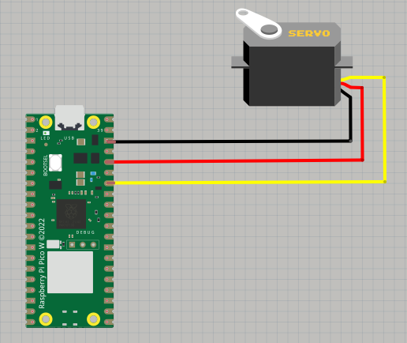
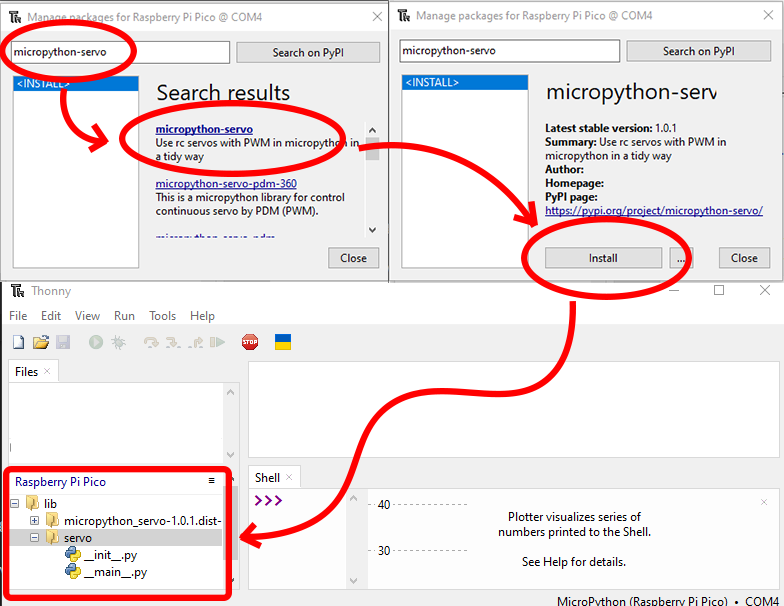

# Fish Feeder

## Overview

The automatic fish feeder enables you to schedule multiple feeding times for your fish. Simply ensure that food is placed in the storage compartment—the feeder will automatically dispense food at the designated intervals.

## Materials Needed

### Hardware

- Raspberry Pi Pico W (with charging cable)
- 3D-printed parts
- SG90 Servo (Continuous Rotation)

    > **Note:** Most SG90 servos are limited to 180-degree rotation. If this applies to your servo, you can follow the [instructions](../../../docs/hack-servo.md) to modify it for 360-degree rotation.

- 3x Male-to-Female jumper wires

### Software

- Thonny IDE. See the [official documentation](https://thonny.org/).

## Circuit

The schematic may vary depending on your device. For the Raspberry Pi Pico W, refer to the [official pinout documentation](https://www.raspberrypi.com/documentation/microcontrollers/pico-series.html#:~:text=Raspberry%20Pi%20Pico%20W%20and%20Pico%20WH).

## 3D Parts and Assembly

Several 3D-printed components are required to build the feeder. You can print these parts from the files in the [3D models](./3D%20models) folder. For the main body, the original piece designed for the Wemos board was removed. Additionally, a Raspberry Pi Pico W case was printed and attached to the main body.

> [!NOTE]  
> The original 3D files are from [CodersCafeTech](https://www.instructables.com/member/CodersCafeTech/) on [Instructables](https://www.instructables.com/Aquassist-DIY-Automatic-Fish-Feeder-With-Companion/).

## Code

First, connect the Raspberry Pi Pico W to your IDE by following the [official setup guide](https://projects.raspberrypi.org/en/projects/getting-started-with-the-pico/3).

To run the code, you will need the **Servo** object from the **micropython-servo** library:

Once the package is installed, copy the [main.py](./main.py), [credentials.py.example](./credentials.py.example) (rename to `credentials.py`), and [utils.py](./utils.py) files to your Raspberry Pi Pico, and run `main.py` in Thonny IDE.

> [!WARNING]  
> To obtain the Firebase keys required for your `credentials.py` file, refer to the [Firebase setup guide](../../../docs/firebase.md). In addition to the Firebase keys, you must also provide your WiFi SSID and password in this file.

## References

- Original concept by CodersCafeTech on [Instructables](https://www.instructables.com/Aquassist-DIY-Automatic-Fish-Feeder-With-Companion/).
- Raspberry Pi Pico cover model from [Thingiverse](https://www.thingiverse.com/thing:4793356).