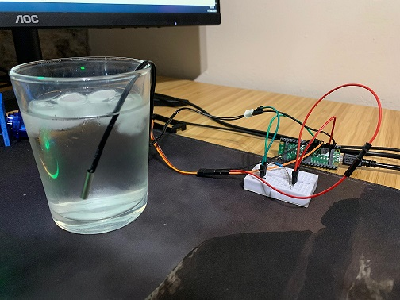

# Water Thermistor

## Overview

Monitoring water temperature is crucial for maintaining a healthy aquatic environment. By adding a water thermistor to the project, you can accurately measure and track temperature changes in real time. This enables automated responses, such as activating heaters or sending alerts, ensuring optimal conditions for aquatic life and preventing potential issues caused by temperature fluctuations.

## Materials Needed

### Hardware

- Raspberry Pi Pico W (with charging cable)
- NTC thermistor 10K + 0.5%
- 10K Resistor
- Minibreadboard
- 2x Male-to-Male jumper wires
- 3x Male-to-Female jumper wires

### Software

- Thonny IDE. See the [official documentation](https://thonny.org/).

## Circuit

The schematic may vary depending on your device. For the Raspberry Pi Pico W, refer to the [official pinout documentation](https://www.raspberrypi.com/documentation/microcontrollers/pico-series.html#:~:text=Raspberry%20Pi%20Pico%20W%20and%20Pico%20WH).

## Code

The code for this project is available under the [RaspberryPi-Pico-W](../) directory.

## References  

- [Project 29：Temperature Instrument](https://docs.keyestudio.com/projects/KS3025/en/latest/Python_Raspberry-Pi/2.Projects/Project%2029%EF%BC%9ATemperature%20Instrument.html) from Raspberry Pi Pico Learnin Kit.