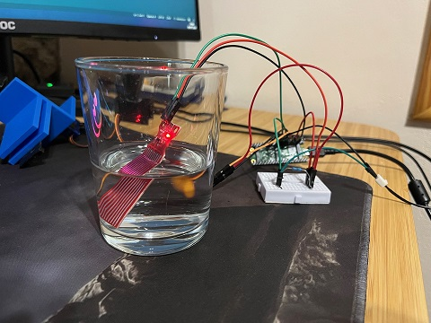
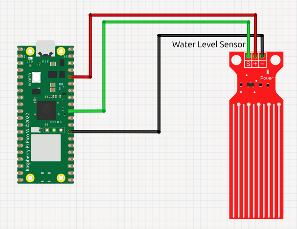

# Water Level Detector

## Overview

Monitoring water level is essential for maintaining a stable aquatic environment. By adding a water level detector to the project, you can accurately measure and track water levels in real time. This enables automated responses, such as refilling the tank or sending alerts, ensuring optimal conditions for aquatic life and preventing issues caused by low water levels.

## Materials Needed

### Hardware

- Raspberry Pi Pico W (with charging cable)
- Water level sensor (analog or digital)
- 3x Female-to-Female jumper wires

### Software

- Thonny IDE. See the [official documentation](https://thonny.org/).

## Circuit

The schematic may vary depending on your device. For the Raspberry Pi Pico W, refer to the [official pinout documentation](https://www.raspberrypi.com/documentation/microcontrollers/pico-series.html#:~:text=Raspberry%20Pi%20Pico%20W%20and%20Pico%20WH).

## Code

The code for this project is available under the [RaspberryPi-Pico-W](../) directory.

## References

- [Analog Inputs in Raspberry Pi Pico](https://controlautomaticoeducacion.com/sistemas-embebidos/micropython/adc-pico-esp/)